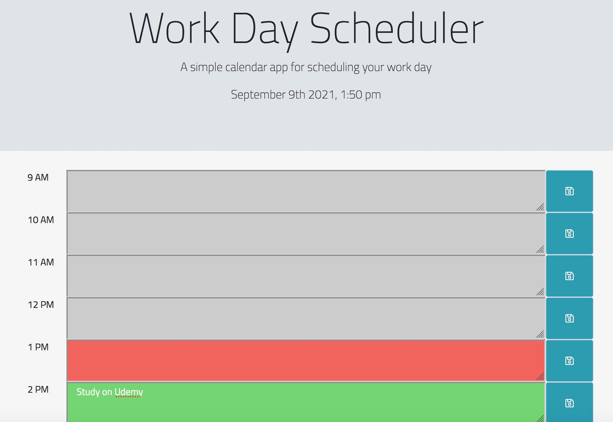

# work-day-scheduler
Modified starter code to allows the user to save events for each hour of the day.  This app will run in the browser and feature dynamically updated HTML and CSS powered by jQuery.

User story: 
AS AN employee with a busy schedule
I WANT to add important events to a daily planner
SO THAT I can manage my time effectively. 

Application will have: 
    -the current date and time posted in the header
    -the blocks are set for standard business hours
    - the time blocks are color coded to indicate whether it is in the past, present and future.
    -When the user clicks on the timeblock, text can be entered and saved.
    -The text is saved to local storage to be accessed at a later date and will persist after a page refresh.

https://github.com/dobinator/work-day-scheduler

